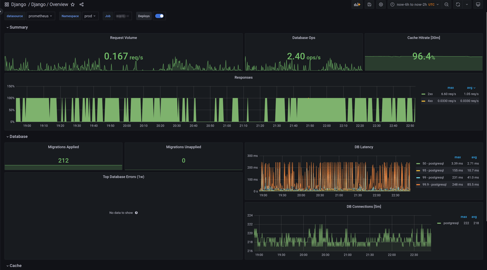
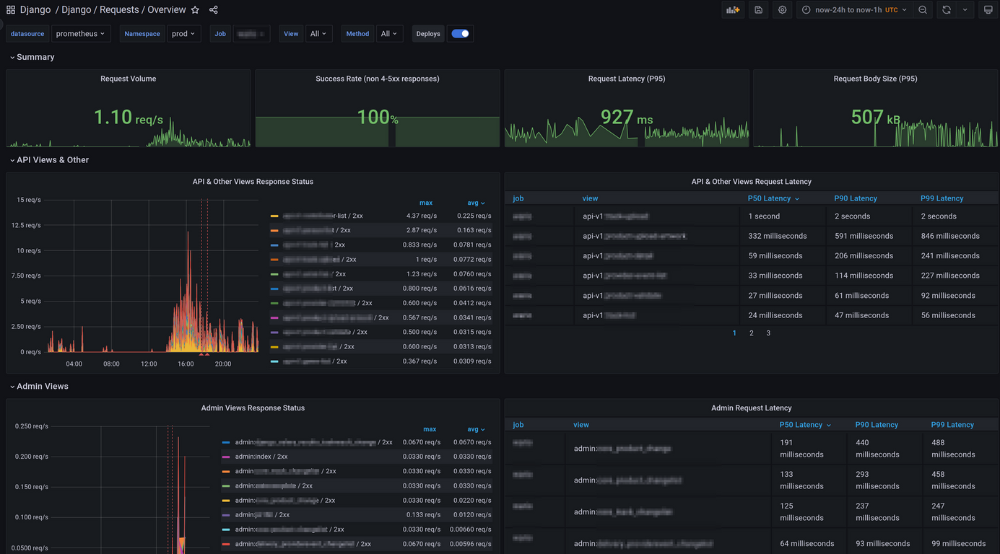
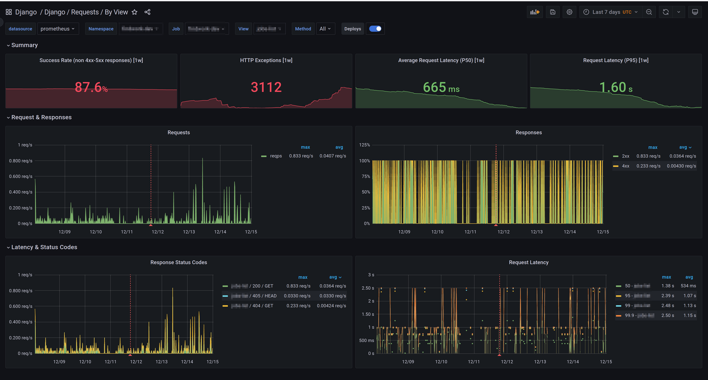

# Prometheus Monitoring Mixin for Django

A set of Grafana dashboards and Prometheus alerts for Django. [Blog post](https://hodovi.cc/blog/django-monitoring-with-prometheus-and-grafana/) covering Django monitoring with Prometheus and Grafana.

## Dashboards

- [Django Overview](https://grafana.com/grafana/dashboards/17617-django-overview/) - Django Overview, a simple overview of the database, cache and requests.



- [Django Requests Overview](https://grafana.com/grafana/dashboards/17616-django-requests-overview/) - Django request overview, providing insights of all requests filterable by view and method. Separate graphs for app and admin views, has as well weekly breakdowns for top templates, top exceptions by type, top exceptions by view and top responses by view.



- [Django Requests by View](https://grafana.com/grafana/dashboards/17613-django-requests-by-view/) - Django requests by view, a breakdown of requests by view that shows compute expensive metrics as latency buckets alongside requests, responses and status codes.



There are also generated dashboards in the `./dashboards_out` directory.

## How to use

This mixin is designed to be vendored into the repo with your infrastructure config.
To do this, use [jsonnet-bundler](https://github.com/jsonnet-bundler/jsonnet-bundler):

You then have three options for deploying your dashboards

1. Generate the config files and deploy them yourself
2. Use jsonnet to deploy this mixin along with Prometheus and Grafana
3. Use prometheus-operator to deploy this mixin

Or import the dashboard using json in `./dashboards_out`, alternatively import them from the `Grafana.com` dashboard page.

## Generate config files

You can manually generate the alerts, dashboards and rules files, but first you
must install some tools:

```sh
go get github.com/jsonnet-bundler/jsonnet-bundler/cmd/jb
brew install jsonnet
```

Then, grab the mixin and its dependencies:

```sh
git clone https://github.com/adinhodovic/django-exporter
cd django-mixin
jb install
```

Finally, build the mixin:

```sh
make prometheus_alerts.yaml
make dashboards_out
```

The `prometheus_alerts.yaml` file then need to passed
to your Prometheus server, and the files in `dashboards_out` need to be imported
into you Grafana server. The exact details will depending on how you deploy your
monitoring stack.

## Alerts

The mixin follows the [monitoring-mixins guidelines](https://github.com/monitoring-mixins/docs#guidelines-for-alert-names-labels-and-annotations) for alerts.
